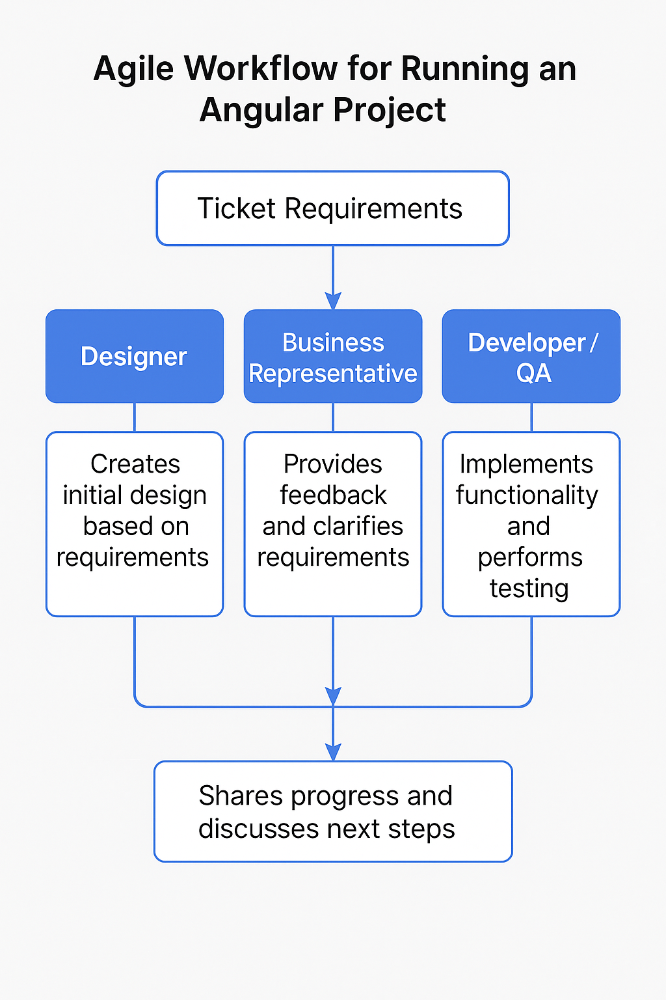

# 🛠️ Project Workflow Guideline

This document outlines the full project flow: from ticket creation to deployment, fitting a **soft agile** process (lightweight, few meetings, functional roles).


## 1. Ticket Requirements

Every feature/bug/task starts with a **ticket**. The tool (e.g Jira or Github projects) 
doesn’t matter if these rules are applied.

Minimum ticket fields:

- **Title:** Clear and short (e.g., `Add language selector to header`)
- **Type:**
    - Feature (new functionality)
    - Bug (fix issues)
    - Chore (maintenance)
    - Spike (research)
- **Description:** Detailed, practical expectations (no essays)
- **Acceptance Criteria:** Bullet points.
    - No acceptance criteria → ticket is invalid.
- **Design Attachments (if any):** Figma (or other), links, images.
    - No **Design** → ticket is invalid.
- **Priority:** High / Medium / Low
- **Labels:** Frontend / Backend / Full-stack / UI-Only / etc.
- **Estimation (Optional):** In hours or small/medium/large if you don't want hard estimates.
- **Dependencies:** Any other tickets or external blockers.

**Template Example:**

```markdown
Title: Add language selector to header

Type: Feature

Description: Add a dropdown to allow users to switch between English and Greek.

Acceptance Criteria:
- Language dropdown is visible in the header.
- Switching language updates all visible text instantly.
- User preference persists after reload.

Priority: Medium

Labels: Frontend, UI-Only

Design Link: [Figma](https://link-to-figma.com)

Dependencies: None
```


## 2. `Business → Designer → Developer → QA`  Responsibilities

### 🔹 Business

- Validate designer output vs business goals.
- Update ticket descriptions or acceptance criteria if needed.
- Confirm business logic, user permissions, etc.
- Output: Approved tickets ready for development.

### 🔹 Designers

- Prepare (**Figma or other tool) designs** or low-fidelity wireframes.
- Always **tag elements** if animations, dynamic behaviors, or specific spacing rules apply.
- If a design is "open to interpretation," communicate with business with proposed changes.
- Output: Share final link + annotate any weird interactions.

### 🔹 Developers

**When picking a ticket:**

1. **Check ticket completeness** (acceptance criteria + design).
2. **Ask for clarification immediately** if anything is missing.
3. **Create a branch, check Git Code Contribution Guide.**
4. **Code key points:**
    - Write small commits (`fix`, `feat`, `refactor` format).
    - Test new components / services if applicable.
    - Follow project code standards (linting, formatting, naming conventions).
    - Translation (`ngx-translate`) keys must match **Translation Contributing Guidelines**.
5. **Push early and often** 
    1. use draft PR for better feedback
    2. PR description
        1. describe the code areas affected that will help the code reviewer
        2. include a link or number to the ticket for the PR changes
    3. commit title
        1. should as short as possible
        2. if using GitHub issues start your title with (#issue number)
    4. commit message (can be omitted if not necessary)
        1. be descriptive
        2. use bullet points
6. **See the Development document(TODO replace with link) for details on the above**

### 🔹 QA

- Test strictly based on ticket acceptance criteria.
- If bug found:
    - If minor → fix and update PR.
    - If major → create a bug ticket linked to the original.
- Perform browser tests (use different browsers and platforms)
- Validate translations (if multilingual project).
- Tag ticket as passed.



---

## 3. Light Agile (Soft Agile — Minimal Meetings)

**Daily Standup:**

- 15 minutes max.
- Everyone says only:
    - What I did yesterday.
    - What I will do today.
    - Any blockers.

**Planning (Biweekly or Weekly):**

- 45 minutes max.
- Priority grooming of the backlog.
- Assignments happen after call between developers.

**Retro (Optional if needed):**

- 30 minutes max every 4 weeks.
- Only actionable feedback allowed.
- Skip if everyone agrees there's no major pain point.

**Sprint Review (No mandatory):**

- 30-45 minutes every 2 weeks.
- Team demonstrates completed work.
- Stakeholders provide direct feedback.
- Product Owner records feedback for backlog updates.

**Backlog Refinement (No mandatory):**

- 45 minutes biweekly.
- Review and update upcoming tickets.
- Break down large items into smaller tasks.
- Clarify requirements and acceptance criteria.
- Update estimations if needed.

>💡
**No mandatory Scrum ceremonies** (no Sprint Reviews, no Backlog Refinement 
**if Backlog is clean and ready**).

## 4. Release Plan

After tickets are merged to `dev`, follow this release flow:

1. **Deploy to UAT/Demo Environment:**
    - 1 week testing period
    - QA team performs full regression
    - Business stakeholders validate features
    - Document any bugs or issues found
2. **Pre-Production Checklist:**
    - All UAT issues resolved
    - Business sign-off obtained
    - Database migrations reviewed
    - Environment variables verified
3. **Production Deployment:**
    - Schedule deployment window
    - Execute deployment
    - Smoke test critical paths
    - Monitor logs and performance

>💡
Always maintain a deployment checklist and document any production issues for future reference. 
e.g. [Git tags](https://git-scm.com/book/en/v2/Git-Basics-Tagging) 


## 5. Testing + Translation Notes

- Always test for translation key existence (`ngx-translate`).
- Always create Integration tests for new services/components.
